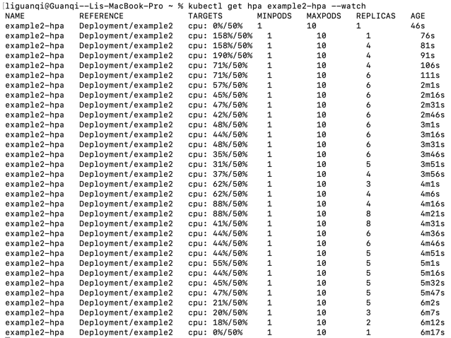

# Jan 30 2026 - What to do the following week

## 1.  K8s vs k3s;  
### try out k3s, and see if anything similar or different
Check out the k3s document!
I would say k3s is a bit low-cost.

## 2. Containerization app, build an image, consume the cpu 
### try to build a new image, and write a script or an api that consumes cpu(set to 50), try to run HPA see if anything should be happening happens(the scaling, the cpu usage raise up as expected)

## 3, metrics: cpu, replicas, timestamp, invocations, delay
### metrics that should be collected
#### 1. Sample HPA + replicas + CPU/mem into a CSV (every N seconds)
install jq (for parsing JSON):

```bash
brew install jq
```

run command:

```bash
chmod +x scripts/collect_hpa.csv.sh
CTX=kind-cluster INTERVAL=1 ./scripts/collect_hpa.csv.sh
```

#### 2. Save autoscaling events (scale up/down reasons) to a file

```bash
kubectl --context kind-cluster -n default get events \
  --field-selector involvedObject.kind=HorizontalPodAutoscaler,involvedObject.name=example1-hpa \
  -w -o json > ./collected_data/hpa_events.jsonl
```

## 4. Poisson distribution. 
### use the given dataset to simulate the real situation, and see if I can make the request fairly distributed in that one minute. 

## 5. Cool down time. 
### the scaling cool down time, manual setting to see if the scaling changes
Check out new setting documents, there's a setting.



## 6. 2 scripts, watch collect metrics, terminal. Script, request. 
### run two scripts in to terminals, and see if there's anything nicer that could make requests 